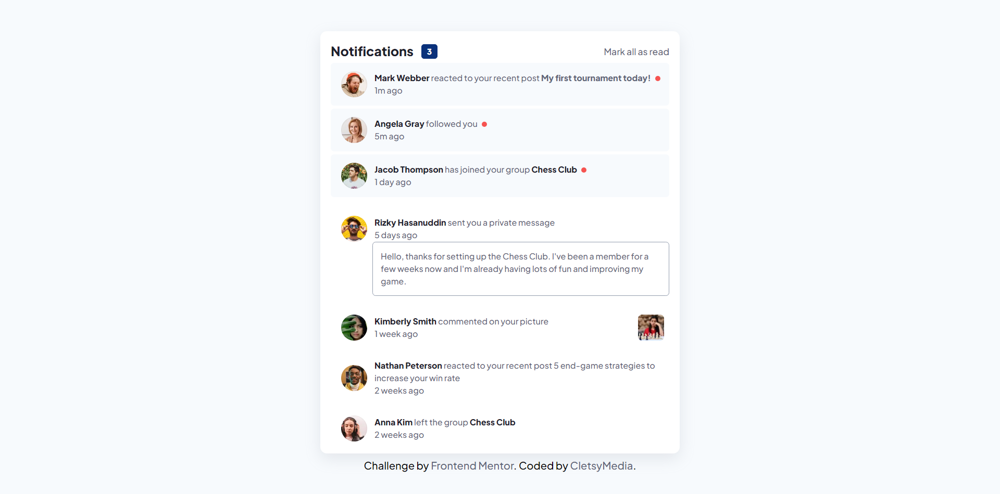

# Frontend Mentor - Notifications page solution

This is a solution to the [Notifications page challenge on Frontend Mentor](https://www.frontendmentor.io/challenges/notifications-page-DqK5QAmKbC). Frontend Mentor challenges help you improve your coding skills by building realistic projects. 

## Table of contents

- [Overview](#overview)
  - [The challenge](#the-challenge)
  - [Screenshot](#screenshot)
  - [Links](#links)
  - [Built with](#built-with)
  - [What I learned](#what-i-learned)
  - [Useful resources](#useful-resources)
- [Author](#author)

**Note: Delete this note and update the table of contents based on what sections you keep.**

## Overview

### The challenge

Users should be able to:

- Distinguish between "unread" and "read" notifications
- Select "Mark all as read" to toggle the visual state of the unread notifications and set the number of unread messages to zero
- View the optimal layout for the interface depending on their device's screen size
- See hover and focus states for all interactive elements on the page

### Screenshot



### Links

- Solution URL: [Repo](https://github.com/CletsyMedia/Notification-Page#screenshot)
- Live Site URL: [View](https://cletsymedia.github.io/Notification-Page/)

### Built with

- Semantic HTML5 markup
- CSS custom properties
- Flexbox
- CSS Grid
- Mobile-first workflow
- Vs-code
- [Styled Components](https://styled-components.com/) - For styles


### What I learned
I learned important keystrokes and nesting divs and some stylings in CSS also the importance of arrow functions.

To see how you can add code snippets, see below:

```html
<h1>Some HTML code I'm proud of</h1>
<div class="notification">
     nested divs      
</div>
```
```css
.proud-of-this-css {
  css variables
}
```
```js
const proudOfThisFunc = () => {
  forEach loop
  arrow=()=>
}
```

## Author

- Website - [Portfolio](https://cletsymedia.github.io/Prof-Portfolio/#work)
- Frontend Mentor - [@CletsyMedia](https://www.frontendmentor.io/profile/CletsyMedia)
- Twitter - [@CletsyMedia](https://www.twitter.com/CletsyMedia)
